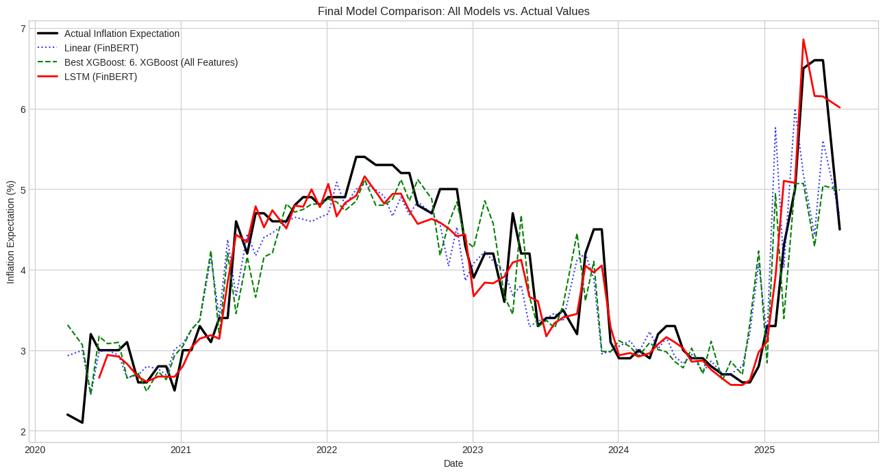

# FOMC Statement Sentiment Analysis for Predicting Inflation Expectations

This project analyzes the sentiment of Federal Open Market Committee (FOMC) statements to forecast future inflation expectations. It demonstrates a complete data science workflow, from data collection and feature engineering with advanced NLP models to systematic model evaluation and validation.

---

## Project Workflow

The project is structured in six key parts as detailed in the notebook:

1.  **Data Collection:** Loading historical FOMC statements (`communications.csv`) and fetching inflation expectation data (`MICH`) from the FRED database.
2.  **Data Preparation and Merging:** Cleaning and merging the textual and economic datasets into a unified analytical base.
3.  **Sentiment Analysis & Feature Engineering:** Engineering three distinct features from the text: LM Sentiment, Uncertainty Score, and an advanced FinBERT Sentiment Score.
4.  **Time Series Modeling:** Systematically training and comparing benchmark Linear Regression models, an LSTM network, and a powerful XGBoost model.
5.  **Evaluation:** Measuring model performance using a chronological train-test split and standard metrics (RMSE/MAE).
6.  **Final Model Validation:** Rigorously validating the champion model (LSTM) using the Walk-Forward Validation method to ensure robust and reliable performance.

---

## Key Results & Conclusion

The analysis concluded that the **LSTM model, augmented with FinBERT sentiment and lagged features, was the champion model.** It significantly outperformed all other models, proving the powerful predictive value of combining deep learning for text analysis with a sequence-aware model architecture.

* **Final Robust RMSE (from Walk-Forward Validation):** **0.2459**

This result confirms that with sufficient historical data, a sophisticated model like an LSTM can effectively learn the complex, non-linear relationships between central bank communications and economic expectations.

### Final Model Comparison

---

## How to Run

1.  Clone this repository.
2.  Ensure you have a Python environment with the libraries listed in `requirements.txt`.
3.  Open and run the `FOMC_Sentiment_Analysis.ipynb` notebook in a Jupyter environment like Google Colab.

---

## Technologies Used
- Python 3
- Pandas & NumPy
- Scikit-learn
- XGBoost
- TensorFlow (Keras) & PyTorch
- Transformers (Hugging Face)
- Matplotlib & Seaborn
- `pandas-datareader`